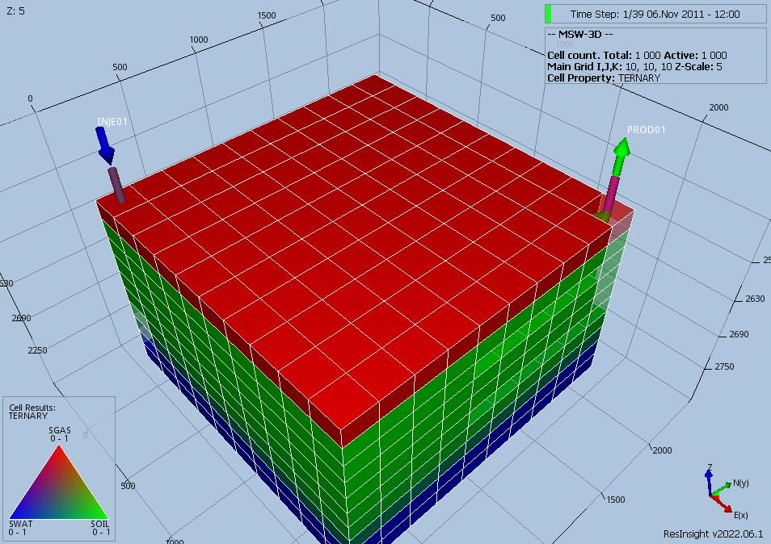

# ACTIONW Test Documentation

Case Name         | Case Desciption                                               | Base Model | Test Type | Results Match | Comments |
----------------- | ------------------------------------------------------------  | ---------- | ----- |------- | ------------------------------------- |
ACTIONW-WPIMULT-00| Base case run, with producers OP01 to OP04 having ACTIONW blocks that applies a PI multiplier 1.00.   | WPIMULT |    | NA     | E100 runs as expected waiting on OPM Flow implementation.
ACTIONW-WPIMULT-01| Producers OP01 to OP04 have an ACTIONW blocks that reduces the PI of the well by 0.900.               | WPIMULT |    | NA     | E100 runs as expected waiting on OPM Flow implementation.
ACTIONW-WPIMULT-02| Various ACTIONW blocks to test behaviour, including nested ACTIONW block (see below).                 | WPIMULT |    | NA     | E100 runs as expected waiting on OPM Flow implementation.
ACTIONW-WPIMULT-03| Various ACTIONW blocks to test behaviour on both producers and injectors (see below).                 | WPIMULT |    | NA     | E100 runs as expected waiting on OPM Flow implementation.
ACTIONW-WPIMULT-04| Various ACTIONW blocks to test behaviour on both producers and injectors (see below).                 | WPIMULT |    | NA     | E100 runs as expected waiting on OPM Flow implementation.
ACTIONW-WPIMULT-05| Various ACTIONW blocks with oil producers productivity indices modified to give more variable results (see below).| WPIMULT |    | NA     | E100 runs as expected waiting on OPM Flow implementation.

**The ACTIONW keyword is currently not supported, but work is ongoing to implement the keyword; thus, these tests are
designed to test the implementation when the keyword has been implemented.**

**Notes:** 

1. _Test Type_ column shows if the case is used for integration testing (_Int_), or regression testing (_Reg_).  
2. _Results Match_ column indicate if the OPM Flow results match the commercial simulator.
3. All models run on five day time steps via the TUNNING keyword.

**Version: 25 November 2022**

### Multi-Segment Well 3D Model (Cartesian Regular Grid Model)

This model is a simple three-phase (10, 10, 10) Cartesian regular grid model that users the rock and fluid properties 
from the Norne full field model. The model has one standard water injector (INJE01) and one multi-segment oil well 
producer (PROD01). Previous versions of this case had inconsistent WELSEGS parameters, which have been corrected in 
this version.

### MSW-3D Description and Results
Base case model with:

1) Base model to test a production multi-segment well (PROD01) in a 3D grid.                  
2) Maximum well water injection rate set to 15,000 m3/d subject to a maximum BHP of 450 barsa
3) Oil production is controled by a minimum BHP of 260 barsa.     
4) Multi-segment well SUMMARY vectors that are currently supported are now written out.

[MSW-3D ECL Results](plots/MSW-3D-ECL.md)

### ACTIONW-01 Description and Results

 1) The field has an oil rate target of 10,000 m3/d and water injection is via PLAT-1 is set VREP 1.00. 
 2) Producers OP01 to OP04 have ACTIONW blocks that multiplies the PI of the well by 0.900 when the water cut exceeds, 
0.20, 0.40 and 0.60.

[ACTIONW_WPIMULT-01 ECL Results](plots/ACTIONW_WPIMULT-01-ECL.md) 
