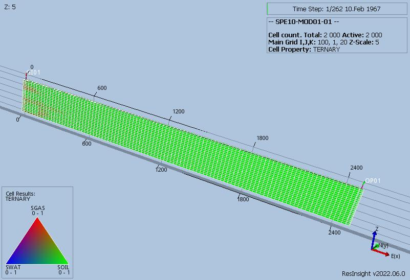
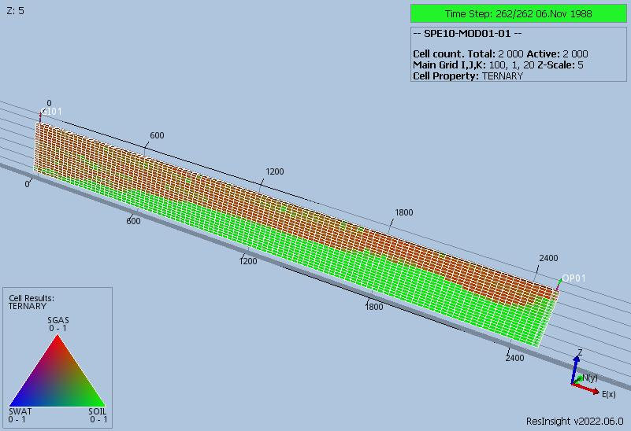
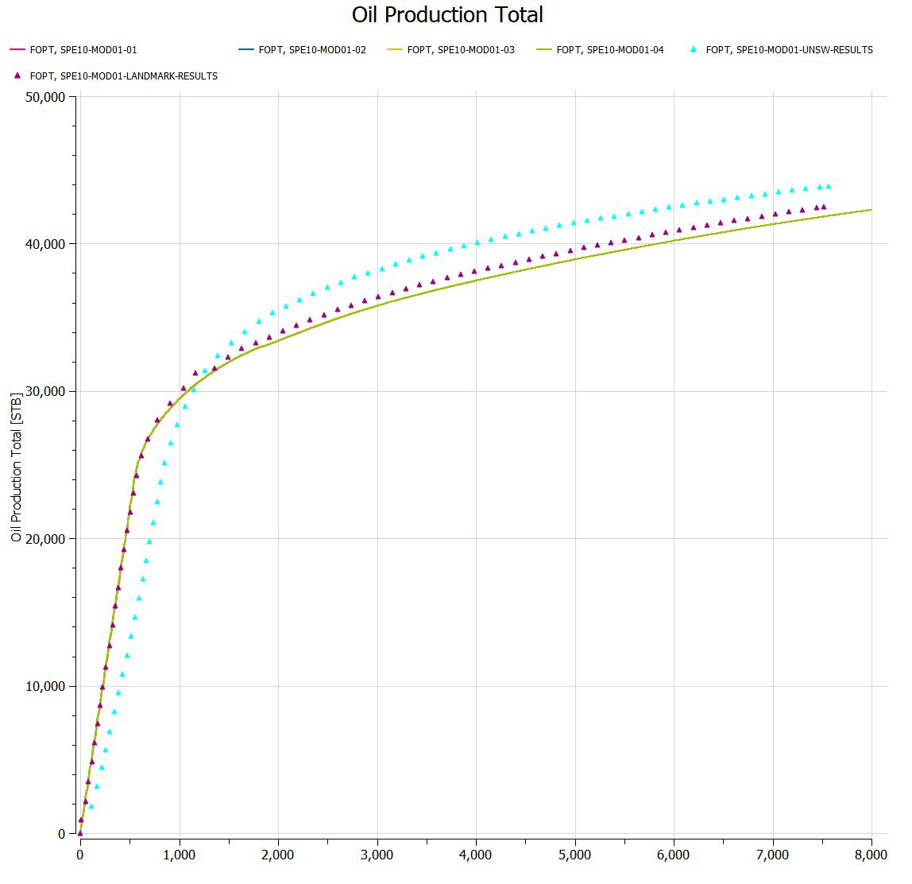
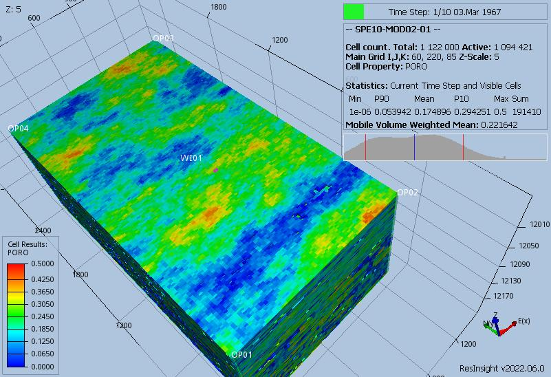
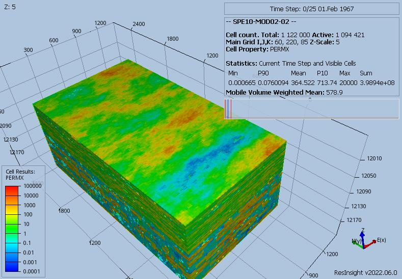
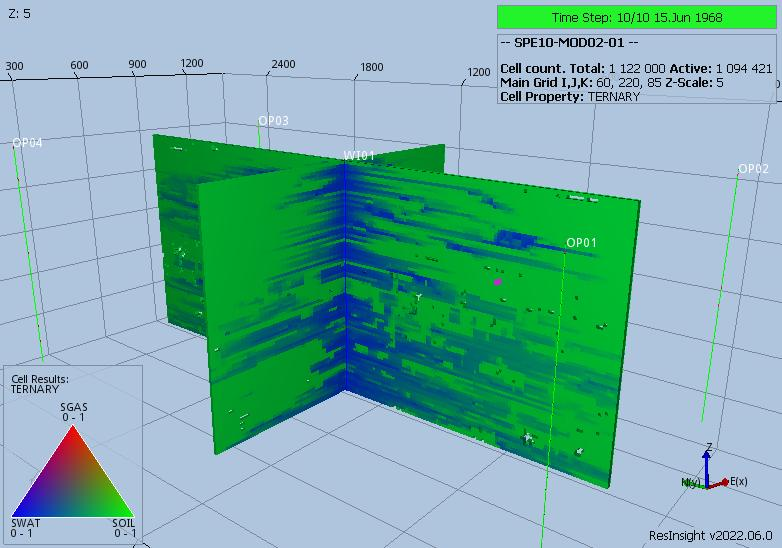
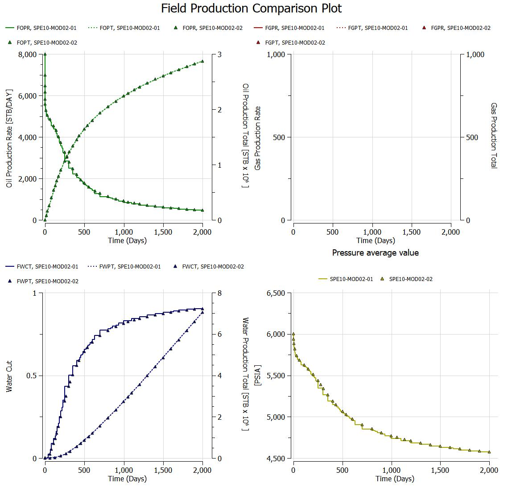
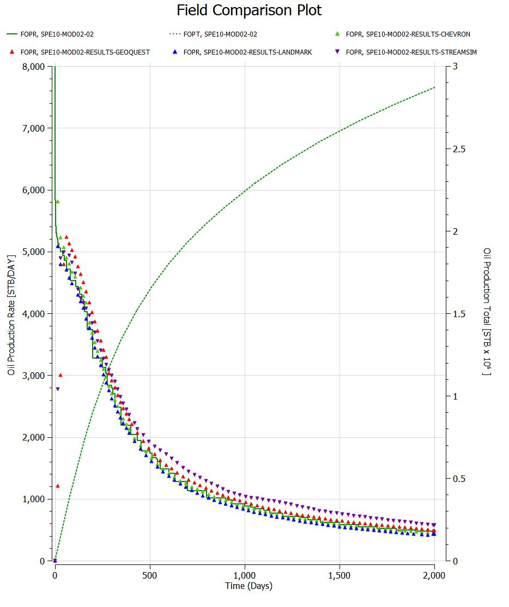

# SPE10 Comparative Solution Project Test Documentation

Case Name     | Case Desciption                                  | Base Model | Test Type | Results Match | Comments |
---------     | -----------------------------                    | ---------- | ---- | ------- | ------------------------------------- |
SPE10-MOD01-01| Three-Phase, with Cartesian regular grid.        | MODEL-01   |      | Yes     | Results are comparable to other vendors as presented in the paper. however, E100 fails to run to completion.
SPE10-MOD01-02| Two-Phase, with Cartesian regular grid.          | MODEL-01   | Int  | Yes     | Results are comparable to other vendors as presented in the paper; however, E100 fails to run to completion.
SPE10-MOD01-03| Three-Phase, with Corner-Point regular grid.     | MODEL-01   |      | Yes     | Results are comparable to other vendors as presented in the paper. E100 not tested.
SPE10-MOD01-04| Two-Phase, with Corner-Point regular grid.       | MODEL-01   |      | Yes     | Results are comparable to other vendors as presented in the paper. E100 not tested.
SPE10-MOD02-01| Three-Phase, with Cartesian regular grid.        | MODEL-02   |      | Yes     | Results are comparable to other vendors as presented in the paper. E100 not tested.
SPE10-MOD02-02| Two-Phase, with Cartesian regular grid.          | MODEL-02   | Int  | Yes     | Results are comparable to other vendors as presented in the paper. E100 not tested.

Both models are based on the SPE 10 comparative SPE paper:

   "Tenth SPE comparative solution project: a comparison of upscaling techniques"
   By Mike Christie (Heriot-Wat University) and Martin Blunt (Imperial College)
   SPE, August 2001.

Originally, these tests were derived when OPM Flow was only able to run three-phase models, and thus these tests were
formulated as pseudo two-phase cases. For 2022, the tests have been re-factored with corrections, and OPM Flow results
have been compared with the published results. Both two-phase and three-phase OPM Flow cases give exactly the same
results, and the results are comparable to the published results from various vendors.

**Notes:**

1. _Test Type_ column shows if the case is used for intergration testing (_Int_), or regression teststing (_Reg_)
2. _Results Match_ column indicate if the OPM Flow results match the published results, see the SPE10.odp document for comparisons.
3. Model one cases run with ten day time steps for comparison purposes.
4. Model two used variable time steps and requires CPR to run, see the parameter files.

**Version: 04 January 2023**

### SPE10 Model 01 ( Cartesian regular/ Irregular Corner-Point)

SPE 10 - MODEL 1 intial ternary saturation plot.

and final ternary saturation plot.

OPM Flow results compared with published results.

OPM Flow results are comparable to the results of other vendors presented in the paper.
All four OPM Flow cases give exactly the same results.

### SPE10 Model 02 ( Cartesian regular)

SPE 10 - MODEL 2 porosity

Permeability

Final ternary saturation

and final pressure distribution.

Two-phase and three-phase results are identical:

OPM Flow results compared with published results, oil production:

Good agreement with published results, although the initial rate seems  too high, this seems a common issue at the
start of runs, with OPM Flow.

And average reservoir pressure:

Good agreement with published results, although the pressure is a bit on the high side, could probably correct for this
by checking the datum pressure etc. Resulted accepted for now.

### Summary
OPM Flow results are comparable to the results of other vendors presented in the paper.

Both two-phase and three-phase OPM Flow cases give exactly the same results.
