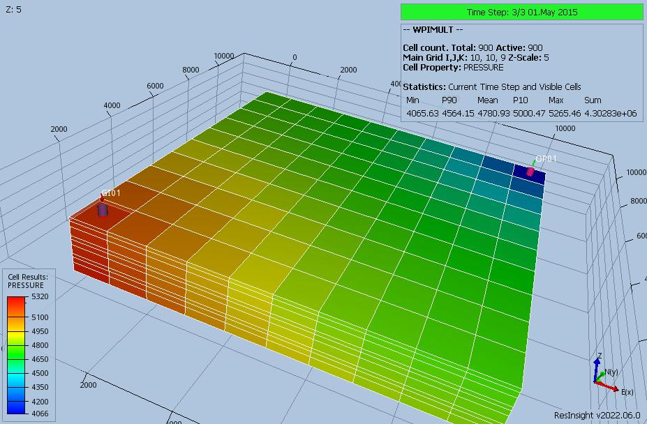

# WPIMULT Test Documentation

Case Name  | Case Desciption                                               | Base Model | Results Match | Comments |
---------- | -----------------------------                                 | ---------- | ------- | ------------------------------------- |
WPIMULT    | Based on SPE01 Case 2 with the number of layers increased to nine.                | WPIMULT    | Yes     | Results are identical to E100.
WPIMULT-01 | WPIMULT(WELPI) set to 0.5 after 30 days, then 0.5 and 2.0 in the same report step | WPIMULT    | Yes      | Results are identical to E100.
WPIMULT-02 | OP01 layers 3, 6, and 9 are open and the well productivity is intially set to 0.3333 using 1* at the start of the run.  One report step later, layers 6 and 9 are shut, then one report time step later the well productivity is increased by 3.0.| WPIMULT    | Yes     |Results are identical to E100.
WPIMULT-03 | Same  as WPIMULT-02 except use 0 (zero) for selection of connections               | WPIMULT    | No      | Results are identical to E100.

**Notes:**

1.  _Results Match_ column indicate if the OPM Flow results match the commercial
 simulator.
2.  All cases run using the TUNING keyword with maximum time step size set to five days.

**Version: 6 December 2022**

### WPIMULT Model (Cartesian Regular Grid)

This simulation is based on the SPE Comparison Case Number 01 based on the data
given in:

   'Comparison of Solutions to a Three-Dimensional Black-Oil Reservoir
   Simulation Problem' by Aziz S. Odeh,
   Journal of Petroleum Technology, January 1981

There are two version of this SPE case based on how gas resolution is modeled.
If DRSDT is set to 0, GOR cannot rise and free gas does not dissolve in
undersaturated oil and implies a constant bubble point pressure, or full
resolution. This is controlled by the DRSDT keyword in the SCHEDULE. The two
cases are therefore:

   (1) Case 1 - Has no resolution of the gas and has the following two
   SPE01-CASE02-OPM1910-R01.DATA lines in the SCHEDULE section:

         DRSDT
         0 /

   (2) Case 2 - Has full resolution of the gas and therefore the DRSDT keyword
   is commented out:

         -- DRSDT
         -- 0 /

This run is for SPE01 Case 2 and is used to test the WPIMULT keyword with the
number of layers being increased to nine, using the same properties of the
original three layers.

### WPIMULT Description and Results

Based model with the number of layers  increased to nine, using the same
properties of the original three layers.

[WPIMULT ECL Results](plots/WPIMULT-ECL.md)

---

### WPIMUTL-01 Description and Results

WPIMULT(WELPI) set to 0.5 after 30 days, then at the next time step set to
0.5 and 2.0 in the same report step.

[WPIMUTL-01 ECL Results](plots/WPIMUTL-01-ECL.md)

---

### WPIMUTL-02 Description and Results

1) OP01 layers 3, 6, and 9 are open and the well productivity is initially set to
0.3333 by WPIMULT with layers set by 1* at the start of the run.
2) One report step later, layers 6 and 9 are shut.
3) One report time step later, the well productivity is increased by 3.0.

[WPIMUTL-02 ECL Results](plots/WPIMUTL-02-ECL.md)

---

### WPIMUTL-03 Description and Results

Same  as WPIMULT-02 except use 0 (zero) for selection of connections.

[WPIMUTL-03 ECL Results](plots/WPIMUTL-03-ECL.md)

---